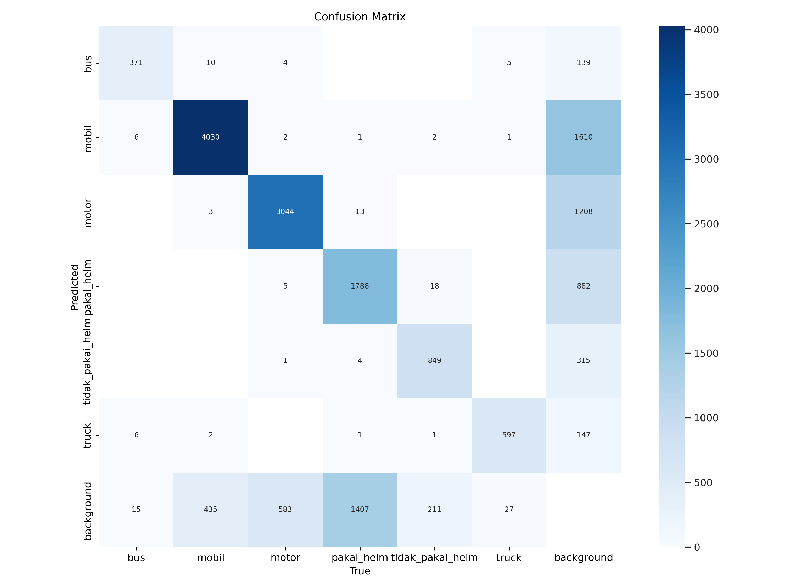
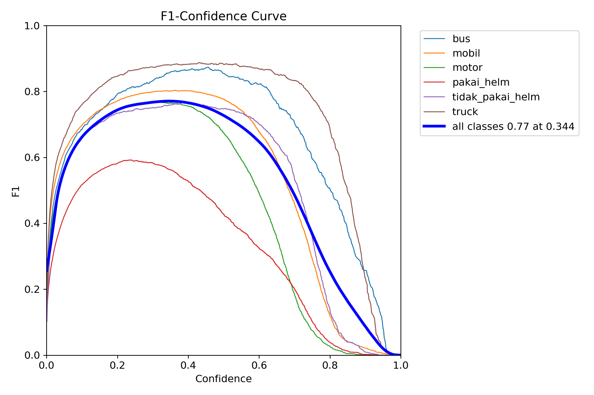
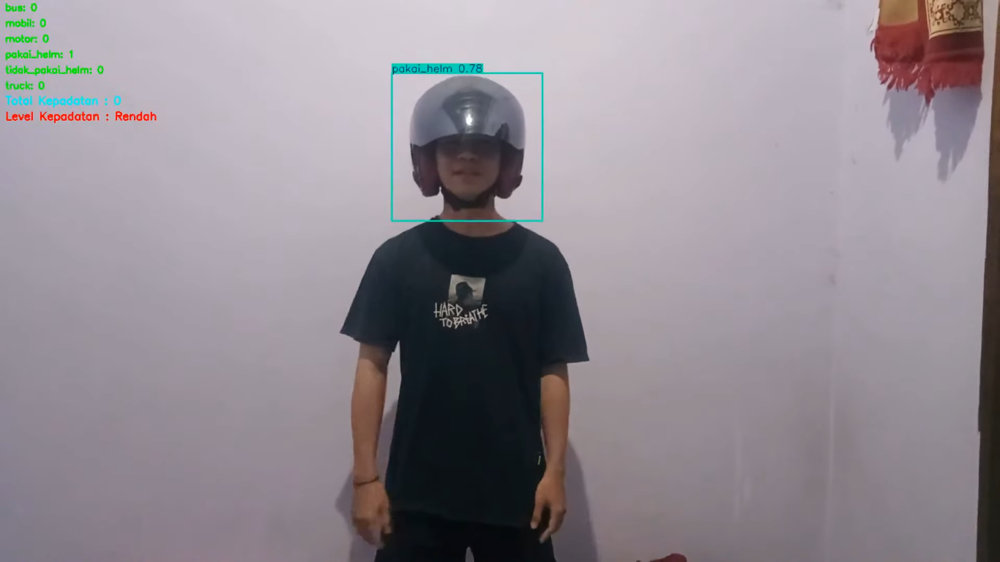
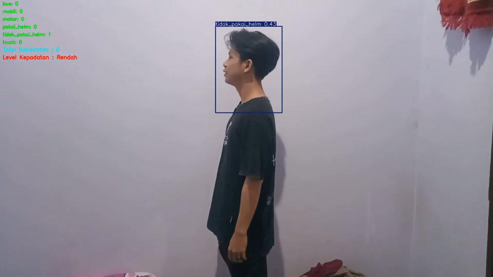
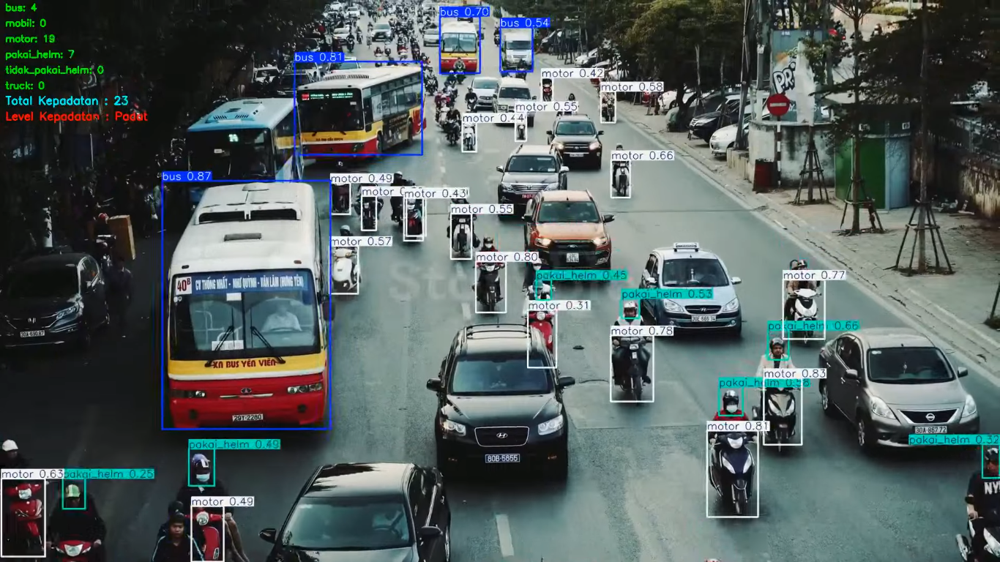
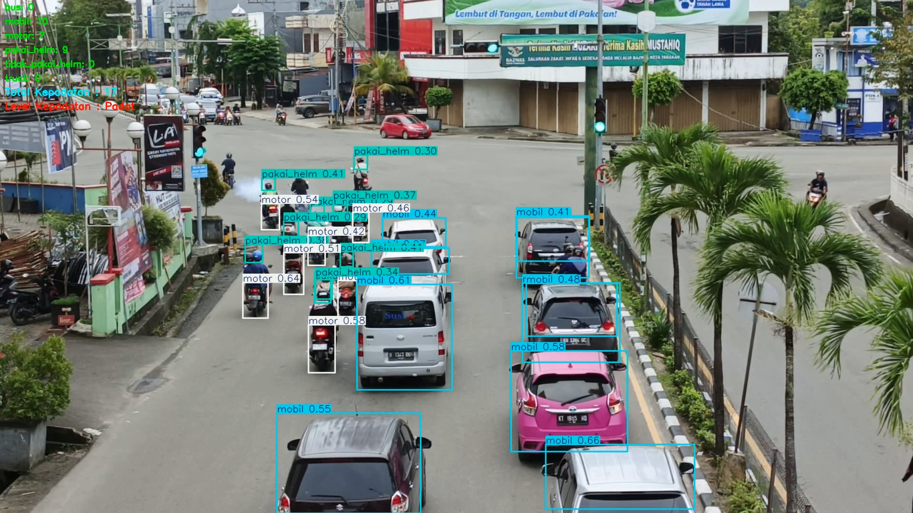

## 🚗 Vehicle Density and Helmet Detection System (YOLOv9)
## 📌 Project Description
A YOLOv9-based traffic density and helmet compliance detection system. It can process static and real-time video, count vehicles (cars, motorcycles, buses, trucks), and detect motorcyclists without helmets with an alarm notification. The model was trained on Google Colab with dataset augmentation through Roboflow, and the detection results can be saved as video output.

## 🛠 Technologies Used
- YOLOv9 for object detection
- Google Colab for model training
- Roboflow for dataset augmentation and management
- OpenCV for video processing
- NumPy for data manipulation
- Windows API (winsound) for beep alarms
- Python as the primary programming language

## 🚀 Key Features
- Realtime Detection: Supports input from webcams/CCTV cameras.
- Video Processing: Can process static video files.
- Vehicle Counting: Counts the number of vehicles based on their class.
- Helmet Detection: Distinguishes between helmeted and unhelmeted drivers.
- Alert System: Beeps when a helmetless driver is detected.
- Output Recording: Automatically saves detected video.

### 📈 Train Result

- Confusion Matrix : shows the number of correct and incorrect predictions for each class.



- F1-Confidence Curve: This graph shows the relationship between the F1-score value and the confidence threshold used by the model.



## 📂 Project Setup
### 1. Download the YOLO configuration file (config.yaml) for the dataset and model. 
### 2. Clone Repository
```bash
git clone https://github.com/404-mind72/Vehicle-Density-and-Helmet-Detection-System-YOLOv9.git
```
### 3. Install Dependencies
```bash
pip install ultralytics opencv-python numpy torch torchvision torchaudio
```
### 4. Download YoLoV9 Model
Note : To use the weight model, please contact my email.
```bash
https://drive.google.com/drive/folders/18JIvKmaZ_7O-y8F-Jws9VlXPXXVhh9L-?usp=sharing
```
### 5. Run The Project
```bash
python App.py
```
### 🎥 Input and Output
- Input : Video file (video_path = "video/video.mp4")
- For Real-time input use cap = cv2.VideoCapture(0) 
- Output : Processed video saved as output_video.mp4
- Visualization : Displays the tracking results with bounding boxes and counts

### 📊 Detection results
- Real time detection results of helmet
  


- Real time detection results of non helmet use
  


- Vehicle detection results using static video
  


- Vehicle detection results using real-time captured in Tarakan City
  


### 🚩Contributions
I would appreciate contributions to improve the model, add or enhance features, and optimize the deployment process. For any queries, reach out to me at joni150703@gmail.com
